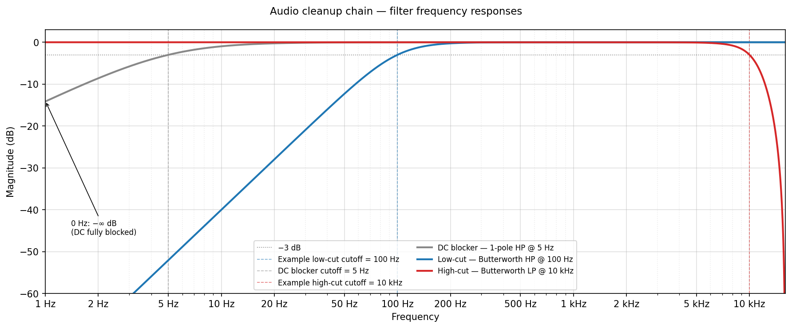

# ESPHome RTSP Audio

[](https://github.com/hendrikvh/ESPHome-RTSP-Audio/actions/workflows/ci.yml)
[](https://github.com/hendrikvh/ESPHome-RTSP-Audio/releases)

This project is an RTSP audio streamer for ESP32 boards built as an ESPHome external component. It is designed to pair with cheap I²S MEMS microphones like the INMP441. The stream is standard RTSP/RTP, so anything that speaks RTSP can consume it. (VLC, ffmpeg, Frigate, BirdNET-Go, and most NVRs). Designed for local streaming on a LAN, not the public internet.

Microphone audio streaming from anywhere there is WiFi using a tiny footprint and even tinier budget. Built so my wife can identify birds in the garden with BirdNET-Go.

See [CHANGELOG.md](CHANGELOG.md) for release notes and the [configuration reference](docs/configuration.md) for all available options.

## Goals

- Stream microphone audio off an ESP32 over standard RTSP.
- Simple: single stream, fixed 32 kHz / mono / 16-bit audio.
- Pair cleanly with ESPHome's mic stack — works with any `microphone:` platform that delivers 32 kHz mono 16-bit (e.g. `i2s_audio`).
- Lightweight: Work on most ESP32s

## Features

Protocols:
- **RTP over UDP** (`RTP/AVP`) — the classic transport. Works with VLC and most media players.
- **RTP over TCP** (`RTP/AVP/TCP`, interleaved) — RTP framed on the RTSP connection. Works with FFmpeg, BirdNET-Go, Frigate, and most NVRs.
- Uncompressed **L16 PCM** audio — 32 kHz mono 16-bit, RTP payload type 96 (`L16/32000/1`). See [Audio format](#audio-format).

Audio processing:
- **Audio cleanup chain** — an always-on DC blocker (kills the MEMS capsule's DC bias before it eats headroom) plus complementary user-tunable 2nd-order Butterworth (biquad) low-cut and high-cut filters from Home Assistant — **−12 dB/oct** rolloff, maximally-flat passband. Low-cut on by default at 100 Hz; high-cut off by default. See [docs/configuration.md#cut-filters](docs/configuration.md#cut-filters).

  **Bypass conventions:** drag the **low-cut slider to 0 Hz** to disable the low-cut entirely; drag the **high-cut slider to 16 kHz** (its max, Nyquist for 32 kHz audio) to disable the high-cut. With both off the chain is bit-identical to a build without those features (DC blocker always runs).

  

  *The −3 dB point is the half-power point — the universally agreed convention for defining a filter's cutoff frequency. See [Why is the cutoff frequency at −3 dB?](docs/configuration.md#why-is-the-cutoff-frequency-at-3-db) for more.*

- **Audio gain in dB, tunable from Home Assistant** — software level adjustment applied after the cut filters. Default 0 dB (unity, bit-identical fast path), range −20 to +40 dB, persisted across reboots. Saturating clamp on overflow, never wraps. See [docs/configuration.md#audio-gain](docs/configuration.md#audio-gain).

Diagnostics and metrics:
- **Diagnostic sensors for Home Assistant** — opt-in `binary_sensor` / `text_sensor` / `sensor` platforms expose client-connected state, client IP, and bytes sent, so you can debug the stream from HA without tailing logs. See [docs/configuration.md#diagnostic-sensors](docs/configuration.md#diagnostic-sensors).
- **CPU-use sensor** — opt-in `cpu_use_pct` reports how much of wall-clock the audio path is consuming, so you can tell whether your board has headroom. See [docs/configuration.md#diagnostic-sensors](docs/configuration.md#diagnostic-sensors).

Other nice touches:
- **Idle nodes carry zero audio buffer overhead.** When no one's listening, no audio buffers exist. They're allocated on `PLAY` and freed on `TEARDOWN` / Wi-Fi loss / peer close. A node that's "ready to stream" 99 % of the time doesn't burn 64 KB of RAM doing nothing, which lets the component share a chip with `voice_assistant`, displays, wake word, etc. without crowding them out.
- **Self-recovery on Wi-Fi drop.** The active session is torn down cleanly and the RTSP listener stays up ready for the next client.
- **Session inactivity timeout.** A client that vanishes without sending `TEARDOWN` (due to crash, sleep, peer Wi-Fi drop) is reaped after 60 s so the single client slot frees up, ready for the next connection.
- **OOM-safe RTP send path.** The transmit buffer is reserved up front so no-PSRAM boards do not run out of memory mid-stream.

## Intentional non-goals to prevent own-goals

- **Only a single client at a time.** Only one RTSP client is served at a time. A second TCP connection is closed immediately (no RTSP-level response) and the device logs `Reject second RTSP client`. A single ring buffer drains into a single transport. Lifting this would mean per-client packet pacing, SSRC, and sequence numbering. Keep it simple.
- **No sample-rate conversion.** The microphone source is fixed at 32 kHz mono 16-bit so PCM passes straight into RTP with no resampler pulled in. Keep it efficient.
- **No Arduino framework support.** The component is gated to ESP-IDF. ESPHome itself is moving to ESP-IDF as the default and Arduino as the legacy path. We follow that direction rather than carry a second build configuration. Keep it targeted.
- **IPv4 only for UDP.** TCP-interleaved RTP works on IPv4 and IPv6, but the UDP media path is IPv4-only. A UDP `SETUP` from an IPv6 client is rejected. If your network is IPv6-only, use TCP transport.

## Quick start

This assumes you are comfortable with ESP boards and ESPHome. If not, now is a good time to learn!

1. **Wire up an I²S microphone to an ESP32.** Defaults assume an INMP441 on an ESP32-S2. The [example YAML](example_rtsp_audio.yaml) uses `GPIO11` (WS), `GPIO9` (SCK), `GPIO12` (SD) but change this as needed. Wire 3.3 V power and ground, then those three signals.

   <details>
   <summary>INMP441 wiring + what each pin does</summary>

   | INMP441 | ESP32 GPIO (example YAML) |
   |---|---|
   | VDD | 3.3 V |
   | GND | GND |
   | WS  | GPIO11 (`i2s_lrclk_pin`) |
   | SCK | GPIO9  (`i2s_bclk_pin`) |
   | SD  | GPIO12 (`i2s_din_pin`) |
   | L/R | GND or VDD (selects channel) |

   - **L/R** — Channel-select. Tie to GND for the left slot or VDD for the right; the `channel:` value in YAML must match.
   - **WS** — Word Select (LRCLK). Timing when the left or right channel data is being sent.
   - **SCK** — Serial Clock (BCLK). Clocks bits out of the mic. Frequency = `sample_rate × bits_per_sample × channels`.
   - **SD** — Serial Data. The mic's audio output. The ESP32 reads this on `i2s_din_pin`.
   - **MCLK** — Not used by the INMP441. Leave `i2s_mclk_pin` unset in YAML.

   WS and SCK are **outputs from the ESP32** (it's the I²S master). SD is the mic's only output.
   </details>

2. **Grab the example YAML.** Copy [`example_rtsp_audio.yaml`](example_rtsp_audio.yaml) into your ESPHome config directory as e.g. `rtsp-audio.yaml`. The example already pulls this component from GitHub via [`external_components`](https://esphome.io/components/external_components.html) (referencing the latest released tag), so there's nothing to install separately.

   Edit two things before flashing:

   - Your Wi-Fi credentials (or set up `secrets.yaml`).
   - The three I²S GPIO pins, if your wiring differs from the defaults.

3. **Validate, compile, flash.**

   Compile and flash like you would any other ESPHome device.

   Via web interface or
   ```bash
   esphome config  rtsp-audio.yaml      # Validate
   esphome compile rtsp-audio.yaml      # Compile
   esphome run     rtsp-audio.yaml      # Install (USB or OTA)
   ```

4. **Listen.** Point an RTSP client such as VLC at the device's IP. Any path the client asks for is accepted, so `rtsp://<node-ip>:554/` works just as well as `rtsp://<node-ip>:554/audio`.

   Find `<node-ip>` in the ESPHome dashboard, your router's DHCP table, or by using the device's mDNS hostname — `rtsp://<esphome-name>.local:554/` works on most networks. Confirm the server is up by looking for `RTSP listening on port 554 (L16/32000/1, PT 96)` in the ESPHome logs, or by enabling the [client-connected diagnostic sensor](docs/configuration.md#diagnostic-sensors) and watching it flip in Home Assistant.

   - **VLC (GUI)** — *File → Open Network…* and enter `rtsp://<node-ip>:554/`.
   - **ffplay (CLI)** — TCP transport is the more reliable default; drop the `-rtsp_transport` flag to use UDP.

     ```bash
     ffplay -rtsp_transport tcp rtsp://<node-ip>:554/
     ```

Transport (UDP or TCP-interleaved) is negotiated per client at `SETUP` — VLC defaults to UDP, FFmpeg / Frigate / BirdNET-Go / most NVRs default to TCP. Both work, no configuration needed.

### Troubleshooting validation errors

- **`Component not found: rtsp_audio`** — the `external_components` block didn't resolve. Double-check the `url:` and `ref:` values in your YAML, and that the build host can reach GitHub.
- **`Component requires framework esp-idf`** — set `esp32: framework: type: esp-idf`. The component intentionally rejects Arduino (see [Intentional non-goals](#intentional-non-goals)).
- **`Microphone sample rate must be 32000`** — set `sample_rate: 32000` on the `microphone:` block. The constraint is enforced by `final_validate_microphone_source_schema`.

## Hardware guidance

The component is built and verified on both `esp32-s2-idf` and
`esp32-s3-idf`. A dual-core ESP32 is recommended, e.g. the ESP32-S3, but the ESP32-S2 that I'm testing on works surprisingly well.

On single-core chips the Wi-Fi stack and the audio loop share one core, so you'll see occasional brief (~1 s) audio gaps when Wi-Fi gets busy. A dual-core chip puts Wi-Fi and the audio loop on separate cores and avoids them.

### ESP32-S2 (e.g. ESP32-S2-Saola-1)

- **Works for the current implementation** (32 kHz sample rate, mono,
  20 ms packets, single viewer). RAM is the tight resource:
  ~10–11 % of internal RAM is used while idle, plus ~64 kB ring buffer
  + ~1.3 kB RTP packet during an active stream.
- **No PSRAM on most S2 boards** — buffers fall back to internal heap.
  Verified to fit, but there's less headroom for additional audio /
  voice components on the same node.
- **Single Xtensa core** — the Wi-Fi stack and the audio loop share one
  core, so expect occasional brief (~1 s) audio gaps when Wi-Fi is busy
  (e.g. a roam scan). They are harmless and self-recovering, but a
  dual-core S3 avoids them. No margin for adding wake-word /
  voice_assistant either.
- Best for: dedicated "RTSP mic" nodes.

### ESP32-S3 (e.g. ESP32-S3 with octal PSRAM)

- **Recommended** when reliability or coexistence with other ESPHome
  audio components matters.
- **PSRAM lands the ring buffer + RTP packet buffer in external RAM**
  automatically (no YAML changes needed). Internal RAM is freed up for
  the rest of the firmware.
- **Dual core** — `loop()` and the I²S DMA pipeline can sit on
  different cores via ESP-IDF's task affinity, giving consistent jitter
  even under load.
- Best for: nodes that combine RTSP audio with `voice_assistant`, wake
  word, displays, etc.

### Smaller / older targets

- **Original ESP32 (Xtensa LX6)**: should also work for the MVP shape
  but isn't part of the build matrix today. If you have one, run the
  S2 test config with `board:` swapped — the code path is the same.
- **ESP32-C3 / C6 (RISC-V)**: untested. There's nothing intentionally
  Xtensa-only in the code, but the audio components targeted by this
  matrix all assume Xtensa today.

Enable the `cpu_use_pct` diagnostic sensor (see [docs/configuration.md#diagnostic-sensors](docs/configuration.md#diagnostic-sensors)) to confirm whether your chosen board has enough headroom for your configuration before committing to it — the recommended way to decide between staying on what you have, upgrading to an ESP32-S3, or disabling features.

### Tested with

- CI builds the component for both `esp32-s2-idf` and `esp32-s3-idf` on every change (see [`tests/components/rtsp_audio/`](tests/components/rtsp_audio/)).
- Hardware-verified on a [LOLIN S2 Mini (ESP32-S2)](https://www.wemos.cc/en/latest/s2/s2_mini.html) with an [INMP441 MEMS microphone module](https://easyelecmodule.com/a-complete-guide-to-the-inmp441-i2s-microphone/).

## How it works

### Audio format

The mic source is set to **L16 PCM, 32 kHz sample rate, mono, 16-bit**. The format is fixed — no resampler is pulled in, so PCM flows straight from the mic into RTP.

- **Usable audio bandwidth** — the **sample rate** is how many times per second the mic is measured; the **highest audio frequency** that can be faithfully captured is half of that, per the [Nyquist–Shannon sampling theorem](https://en.wikipedia.org/wiki/Nyquist%E2%80%93Shannon_sampling_theorem) (you need at least two samples per cycle to reconstruct a wave). So at a 32 kHz sample rate we can capture audio content up to **16 kHz**. This is currently not configurable.
- **Why 32 kHz sample rate, not higher or lower** — the MEMS mics this targets are not high-fidelity capsules and don't faithfully reproduce content above ~16 kHz, so going higher (e.g. 48 kHz, giving 24 kHz of audio bandwidth) would just spend CPU and Wi-Fi on headroom the mic can't fill. Going lower (e.g. 16 kHz sample rate → 8 kHz audio bandwidth) would lose the upper octave of voice sibilance and most bird-call detail.
- **CPU cost** — On an ESP32-S3 the audio path still sits well under the comfort budget described in the CPU-use sensor section above.
- **Wi-Fi / packet size** — RTP packets are ~1.3 KB at the default 20 ms packet duration, still well under MTU. Both UDP and TCP transports are unaffected.

## Support for all ESP32s

### Sized to fit ESP32 internal SRAM (no PSRAM required)

We want this to "just work" on any ESPHome-capable ESP32 — including the cheap WROOM boards everyone has in a drawer — so the buffer is sized for the no-PSRAM case. The RTSP client adds its own jitter buffer (VLC, ffmpeg, NVRs all hold ~500 ms–1 s before playback starts), so end-to-end resilience is closer to 1.5–2 s.

The jitter ring buffer is sized for **1 second of audio** (~64 KB at 32 kHz mono 16-bit). That's a deliberate compromise: 2 s would absorb longer Wi-Fi stalls, but it would also push the buffer past what a bare ESP32 can hand out as a single contiguous chunk of internal RAM.

The ESP32 family is split on PSRAM:

- **No PSRAM** — bare `ESP32-WROOM`, most `ESP32-S3-WROOM-1` SKUs without an `R` in the part number, and all current `ESP32-C3` / `-C6` / `-H2` parts (the RISC-V chips don't even support PSRAM). These boards have ~320 KB of internal SRAM total, most of it claimed by Wi-Fi, LwIP, and the ESPHome runtime — a 128 KB contiguous allocation routinely fails on them.
- **With PSRAM** — `WROVER` variants, `ESP32-S3-WROOM-1-N…R8` / `-R2`, and PSRAM-equipped S2 modules (e.g. LOLIN S2 Mini). 2 MB or 8 MB external RAM is plenty.

A future enhancement would be to detect PSRAM at runtime and grow the ring buffer to 2 s when available, giving PSRAM boards the extra safety margin without breaking the bare-WROOM path.

## Development

All tests and firmware builds run inside Docker — only `docker` is required on the host. Use the [`Makefile`](Makefile):

```
make help            # list targets
make config          # esphome config on each test YAML
make compile         # full firmware build for each test YAML
make compile BOARD=s3-idf
make test            # host C++ unit tests (gtest, ctest) in Docker
make lint            # pre-commit hooks (clang-format, ruff, ...)
```

YAML smoke configs live under [`tests/components/rtsp_audio/`](tests/components/rtsp_audio/) for both `esp32-s2-idf` and `esp32-s3-idf`.

See [`CONTRIBUTING.md`](CONTRIBUTING.md) for more details.
